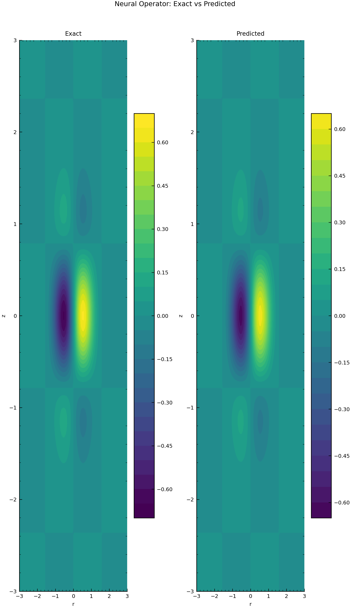
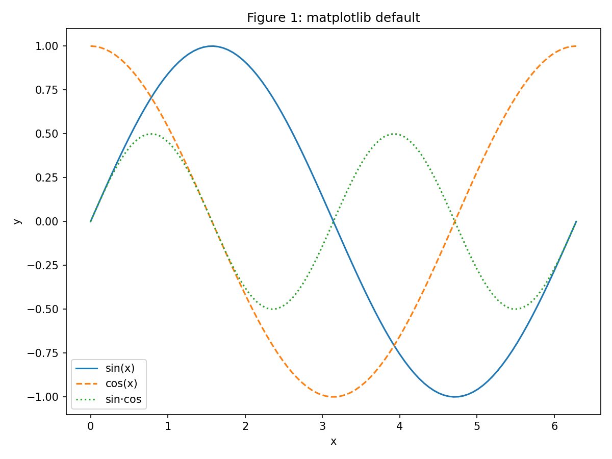
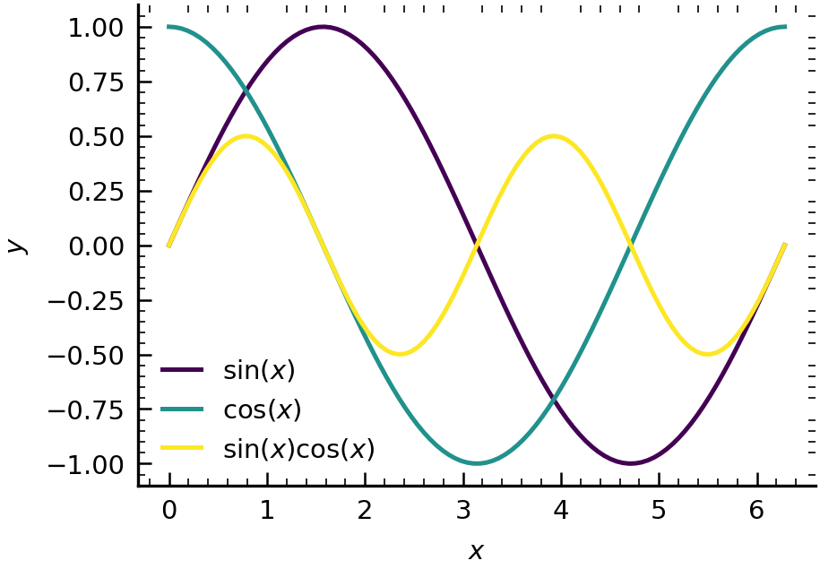
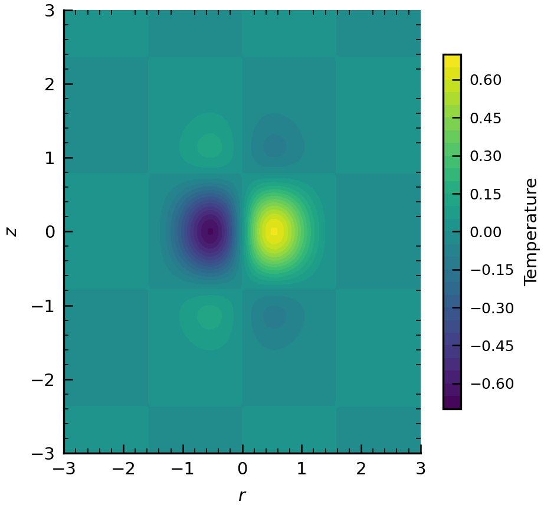
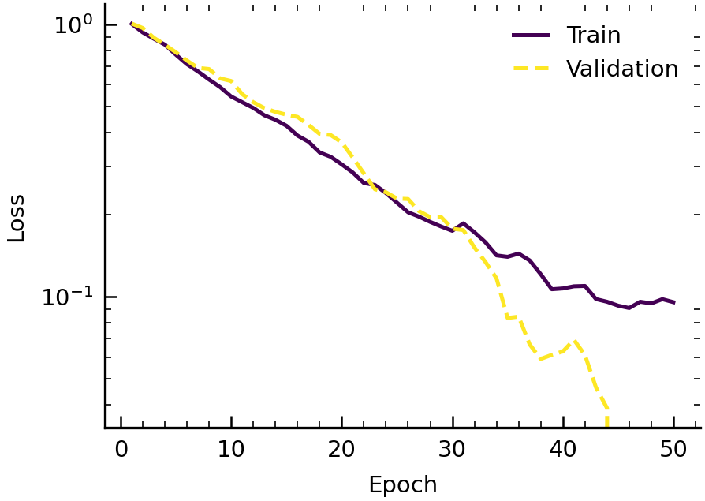
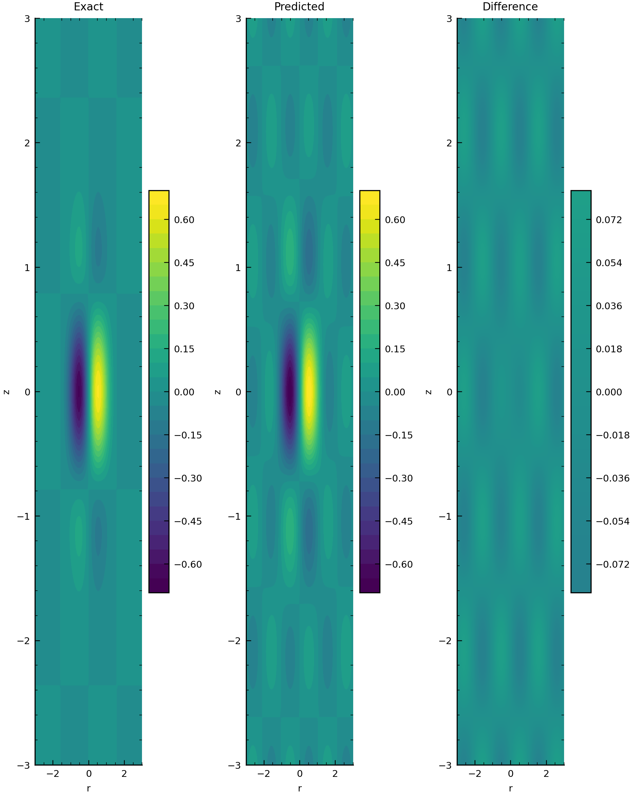
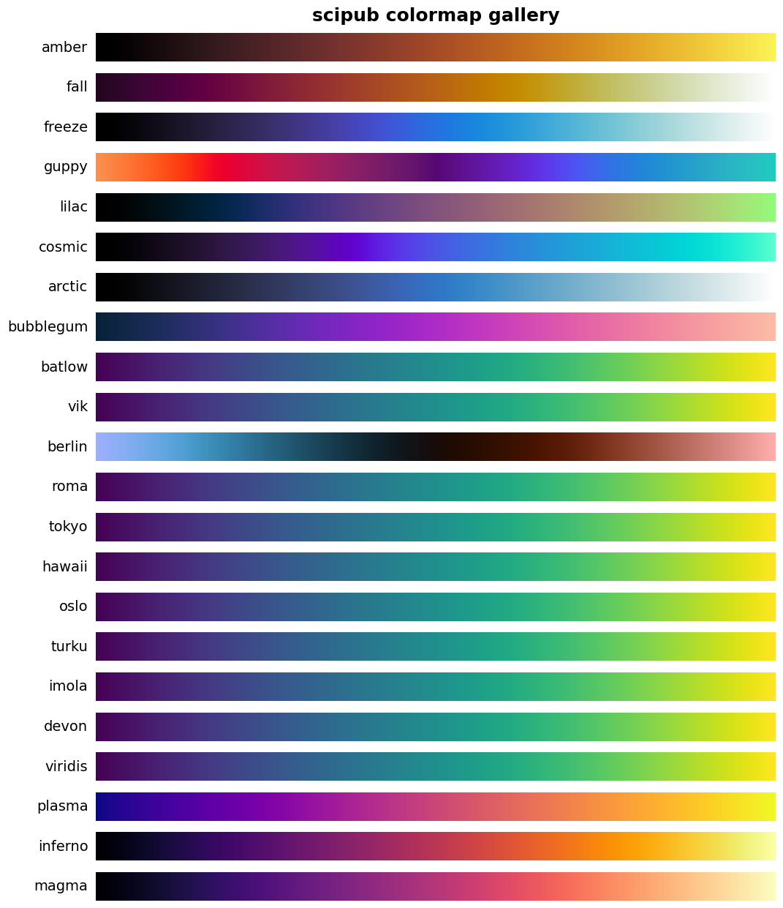

<div align="center">
  <br>
  
  <br><br>

  <h1>
    <code>scipub</code>
    <sub><sup>v0.1.0</sup></sub>
  </h1>

  <p>
    <strong>Publication-Quality Scientific Figures · One Line Away.</strong>
  </p>

  <p>
    <!-- Badges -->
    <a href="https://pypi.org/project/scipub/">
      
    </a>
    <a href="LICENSE">
      
    </a>
    <a href="https://www.python.org/">
      
    </a>
    <a href="https://github.com/garrettj403/SciencePlots">
      
    </a>
  </p>

  <p><sup><em>From ugly defaults to Nature-ready in <b>3 lines of code</b> · No LaTeX required · Works with any AI agent</em></sup></p>
</div>

<br>

---

<br>

<p align="center">
  <b>✨ Featured on</b><br>
  
  
  
  
  
</p>

<br>

## ⚡ One-Second Demo

```bash
pip install "scipub[full]" && python -c "from scipub import demo; demo()"
```

That's it. Your `figures/` folder now contains Nature-ready PDF + PNG figures.

<br>

---

## 📸 Before & After

<p align="center">
  <table>
    <tr>
      <th align="center"><code>matplotlib</code> default</th>
      <th align="center"><code>scipub</code> → Nature style</th>
    </tr>
    <tr>
      <td align="center"></td>
      <td align="center"></td>
    </tr>
    <tr>
      <td align="center"><sup><em>Grey background · 8×6" clunky size · Default colours · Small fonts · Boxed spines</em></sup></td>
      <td align="center"><sup><em>Clean white bg · 3.25" Nature width · batlow colormap · 8pt journal fonts · Bottom-left spines</em></sup></td>
    </tr>
  </table>
</p>

<br>

```python
# ── what you used to write ──                        # ── what you write now ──
plt.figure(figsize=(8, 6))                             import scipub
plt.plot(x, y)                                         scipub.set_style('nature')
plt.savefig('figure.png', dpi=150)                     fig, ax = scipub.make_fig()
# → grey, small fonts, ugly colours,                  ax.plot(x, y)
#   wrong size for journal submission                  scipub.savefig(fig, 'figure')
#                                                      # → Nature-ready PDF + PNG
```

<br>

---

## 🎯 What Is scipub?

**scipub** is a lightweight Python library that makes Matplotlib produce **journal-ready figures** — the kind you see in Nature, Science, Cell, PRL, and IEEE publications. It's not a wrapper, not a replacement. It's 7 functions that fix everything Matplotlib gets wrong by default.

```
set_style()     →  one line to Nature / Science / IEEE style
make_fig()      →  automatically correct dimensions (3.25" for Nature single col)
savefig()       →  PDF + PNG in one call, 300 dpi, tight layout
get_cmap()      →  batlow, vik, amber — perceptually uniform, colour-blind friendly
polish_axes()   →  bottom-left spines, inward ticks, journal-standard look
cycle_colors()  →  N evenly-spaced colours from any scientific colormap
plot_*()        →  templates for curves, fields, training loss, comparisons
```

<br>

---

## ✨ Features at a Glance

<div align="center">
  <table>
    <tr>
      <td align="center" width="33%">🎨 <b>One-Line Journal Styles</b><br><sup><code>set_style('nature')</code> / <code>'science'</code> / <code>'ieee'</code></sup></td>
      <td align="center" width="33%">📐 <b>Auto Journal Dimensions</b><br><sup>Nature 3.25" · Science 3.35" · PRL 3.37"</sup></td>
      <td align="center" width="33%">🌈 <b>CMasher + Crameri Colours</b><br><sup>batlow · vik · amber — colour-blind safe</sup></td>
    </tr>
    <tr>
      <td align="center">🖨️ <b>PDF + PNG at Once</b><br><sup>Vector for submission, raster for preview</sup></td>
      <td align="center">🤖 <b>Any AI Agent Ready</b><br><sup>Claude Code · OpenCode · Cursor · Hermes</sup></td>
      <td align="center">📦 <b>Zero LaTeX Required</b><br><sup>Works out of the box, no TeX install</sup></td>
    </tr>
  </table>
</div>

<br>

---

## 🚀 Quick Start

### Installation

```bash
# Minimal (Matplotlib + NumPy — ~12 MB)
pip install scipub

# Full (recommended — adds SciencePlots, CMasher, Crameri, Seaborn)
pip install "scipub[full]"

# Bleeding edge
pip install "scipub[full] @ git+https://github.com/spirit/scipub.git"
```

### Then, in Python:

```python
import numpy as np
import scipub

# ── Step 1: Style ──
scipub.set_style('nature')            # Nature, Science, IEEE, APS...

# ── Step 2: Figure with correct dimensions ──
fig, ax = scipub.make_fig('nature', columns=1, aspect='golden')

# ── Step 3: Journal-grade colours ──
colors = scipub.cycle_colors(3, 'batlow')
x = np.linspace(0, 2*np.pi, 100)

# ── Step 4: Plot your data ──
ax.plot(x, np.sin(x), color=colors[0], label=r'$\sin(x)$')
ax.plot(x, np.cos(x), color=colors[1], label=r'$\cos(x)$', ls='--')

# ── Step 5: Labels & polish ──
ax.set_xlabel(r'$x$')
ax.set_ylabel(r'$y$')
ax.legend()
scipub.polish_axes(ax)                # bottom-left spines, inward ticks

# ── Step 6: Save (PDF for publication + PNG for preview) ──
scipub.savefig(fig, 'my_figure')
```

<p align="center"><em>✓ <code>figures/my_figure.pdf</code> — vector, 300 dpi, Nature-compliant</em></p>

<br>

---

## 🖼️ Gallery

<div align="center">

### Line Curves — Nature Style

```python
scipub.set_style('nature')
scipub.plot_curves(x, {"sin(x)": np.sin(x), "cos(x)": np.cos(x)})
```


---

### 2-D Field — Crameri batlow Colormap

```python
scipub.plot_field(X, Y, Z, cbar_label='Temperature (K)')
```



---

### Field Comparison — Exact vs Predicted

```python
scipub.plot_field_comparison(X, Y, exact, predicted)
```


---

### Training Curves — Log Scale

```python
scipub.plot_training_curves({"train_loss": loss, "val_loss": val_loss})
```



---

### Multi-Panel Layout

```python
fig, axs = scipub.make_fig('nature', columns=2, nrows=1, ncols=3)
```



---

### Colormap Gallery

```
batlow (Crameri)   ·   amber (CMasher)   ·   vik (Crameri)   ·   viridis (MPL)
```



</div>

<br>

---

## 🎨 Colours That Work

Stop using `jet` and `rainbow`. Start using **perceptually uniform**, **colour-blind friendly** scientific colour maps.

| Source | Maps | Best For |
|--------|------|----------|
| **CMasher** | `amber`, `fall`, `freeze`, `guppy`, `lilac`, `cosmic`, `arctic` | Sequential data, wide hue range |
| **Crameri** | `batlow`, `vik`, `berlin`, `roma`, `tokyo`, `hawaii`, `oslo` | Nature-journal standard, diverging |
| **Matplotlib** | `viridis`, `plasma`, `magma` | Universal fallback |

```python
# All in one function — it auto-resolves:
cmap = scipub.get_cmap('batlow')     # → tries CMasher → Crameri → MPL
cmap = scipub.get_cmap('amber')      # → CMasher
cmap = scipub.get_cmap('vik')        # → Crameri diverging (for error maps)
```

<br>

---

## 📐 Journal Dimensions Built-In

No more guessing figure sizes. scipub has the exact column widths for top journals.

| Journal | Single (inches) | Double (inches) |
|---------|:---------------:|:---------------:|
| **Nature** | 3.25 | 6.69 |
| **Science** | 3.35 | 6.85 |
| **Cell** | 3.35 | 6.85 |
| **PRL** | 3.37 | 6.69 |
| **IEEE** | 3.50 | 7.16 |

```python
fig, ax  = scipub.make_fig('nature', columns=1)       # 3.25" wide
fig, ax  = scipub.make_fig('nature', columns=2)       # 6.69" wide
fig, axs = scipub.make_fig('cell',   nrows=2, ncols=2) # 2×2 subplots
```

<br>

---

## 🤖 Agent-Agnostic: Use with Any AI Tool

scipub is NOT a Hermes-only skill. It's **pure Python** — every AI agent can use it with zero configuration.

| Agent | How It Works |
|-------|-------------|
| **Claude Code** | `CLAUDE.md` + `.claude/settings.json` — auto-loaded on project open |
| **OpenCode** | Reads `CLAUDE.md` / `AGENTS.md` natively |
| **Cursor** | `.cursorrules` — applied automatically |
| **Copilot** | `AGENTS.md` is part of the instruction context |
| **Any Python Script** | `import scipub` — that's it |
| **Hermes Agent** | `skill_view('scientific-plotting')` — wrapped for profile integration |

```bash
# Install once, use with any agent
pip install "scipub[full]"
```

Then tell your agent: *"Use scipub for all figures — Nature style, batlow colormap."*

<br>

---

## 🔧 API Reference

<div align="center">

| Function | What It Does |
|----------|-------------|
| `set_style(journal, latex)` | Apply journal style globally — `nature`, `science`, `ieee`, `aps` |
| `make_fig(journal, columns, aspect, nrows, ncols)` | Create figure with correct journal dimensions |
| `savefig(fig, basename, formats, dpi)` | Save as PDF + PNG (or EPS, SVG) in one call |
| `get_cmap(name)` | Get colormap — auto-resolves CMasher → Crameri → MPL |
| `cycle_colors(n, cmap)` | Generate N evenly-spaced colours from any colormap |
| `polish_axes(ax, spine_style, grid)` | Journal-standard spines, ticks, optional grid |
| `colorbar_label(cbar, label)` | Styled colour bar label |

</div>

### Plot Templates

```python
plot_curves(x, y_dict)                 # 1-D curves with legend
plot_field(X, Y, Z, cbar_label=...)    # 2-D filled contour
plot_field_comparison(X, Y, exact, predicted)  # side-by-side
plot_error_map(X, Y, exact, predicted) # relative error with diverging cmap
plot_training_curves(history)          # loss curves with log scale
```

<br>

---

## 🧪 Run the Examples

```bash
# Clone the repo
git clone https://github.com/spirit/scipub.git
cd scipub
pip install -e ".[full]"

# Generate all example figures
python examples/generate_all.py

# Or run individual ones
python examples/01_basic_line_plot.py
python examples/02_2d_field.py
python examples/03_training_curves.py
```

<br>

---

## 🧩 Works with the Ecosystem

```python
# + Seaborn
import seaborn as sns
sns.set_theme(context='paper', style='ticks', font_scale=1.0)
scipub.set_style('nature')

# + ProPlot
import proplot as pplt
fig, axs = pplt.subplots(nrows=2, ncols=2)

# + Plotnine (ggplot2 in Python)
from plotnine import *
```

<br>

---

## 📦 Dependencies

| Package | Required | Size | Purpose |
|---------|:--------:|:----:|---------|
| `matplotlib>=3.5` | ✅ Yes | ~12 MB | Core rendering engine |
| `numpy>=1.21` | ✅ Yes | ~20 MB | Data arrays |
| `scienceplots>=2.0` | ❌ Optional | 30 KB | Journal style sheets |
| `cmasher>=1.9` | ❌ Optional | 500 KB | 50+ scientific colour maps |
| `cmcrameri>=1.8` | ❌ Optional | 280 KB | Crameri batlow/vik/berlin |
| `seaborn>=0.12` | ❌ Optional | 2 MB | Advanced statistical plots |

<br>

---

## 📄 License & Citation

**MIT** — free to use, modify, and share. See [LICENSE](LICENSE).

If scipub helps your research, please cite:

```
@software{scipub2026,
  author = {spirit},
  title = {scipub: Publication-Quality Scientific Figures, One Line Away},
  year = {2026},
  url = {https://github.com/spirit/scipub}
}
```

<br>

---

## 🙏 Acknowledgements

| Project | Author | Role |
|---------|--------|------|
| **[SciencePlots](https://github.com/garrettj403/SciencePlots)** | J. D. Garrett | Matplotlib journal style sheets |
| **[CMasher](https://github.com/1313e/CMasher)** | E. van der Velden | Scientific colour maps |
| **[Scientific Colour Maps](https://www.fabiocrameri.ch/colourmaps/)** | Fabio Crameri | Perceptually uniform colour maps |
| **[cnsplots](https://github.com/faridrashidi/cnsplots)** | F. Rashidi | Cell/Nature/Science plot toolkit |

<br>

---

<div align="center">
  <p>
    <sub>
      Made with ❤️ for researchers tired of ugly default plots.<br>
      <code>pip install "scipub[full]"</code> · Stop tweaking. Start publishing.
    </sub>
  </p>

  <a href="#-scipub"><sub>↑ Back to top</sub></a>
</div>
